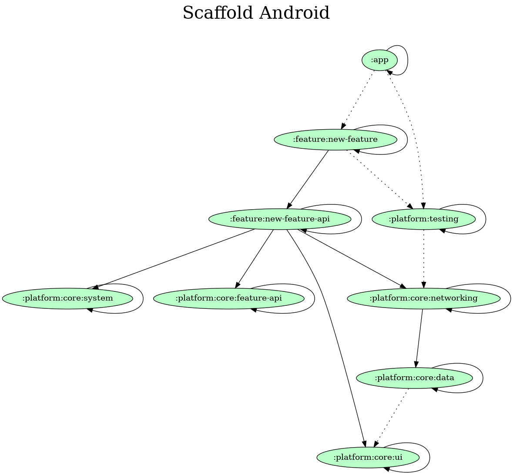

# Scaffold Android

**Scaffold Android** is a scaffold that serve as a skeleton to other scalable Android apps.

## Stack and Libraries

- [Kotlin](https://kotlinlang.org/)
- [Android Compose](https://developer.android.com/jetpack/compose)
- [Coroutines](https://developer.android.com/kotlin/coroutines)
- [Chucker](https://github.com/ChuckerTeam/chucker)
- [LeakCanary](https://github.com/square/leakcanary)
- [Hilt](https://developer.android.com/training/dependency-injection/hilt-android)
- [Navigation Compose](https://developer.android.com/jetpack/compose/navigation)
- [Retrofit](https://github.com/square/retrofit)
- [Gradle Version Catalogs](https://docs.gradle.org/current/userguide/platforms.html)

## Modularization

## Architecture

It was used an approach of [MVVM](https://developer.android.com/topic/architecture)
(Model-View-ViewModel) targeting Android Compose for the architecture.

## CI

- [Kotlinter Gradle](https://github.com/jeremymailen/kotlinter-gradle)
- [Detekt](https://github.com/detekt/detekt)
- [Android Lint](https://developer.android.com/studio/write/lint)
- [Unit tests](https://developer.android.com/training/testing/local-tests)
- [Integration tests](https://developer.android.com/training/testing/fundamentals)

## Steps to use Scaffold Android

1. Clone the repository (https://github.com/orogersilva/scaffold-android.git).
2. Delete `.git` folder.
3. Edit `README.md`.
4. Type `git init` in the project root folder.
5. Rename packages (in the whole project).
6. Rename all namespace names in the `build.gradle` files.
7. Rename the `applicationId` in the `build.gradle` file in the `app` module.
8. Rename the app theme name in the `:platform:core:ui` module.
9. Rename `BASE_API_URL` in the `build.gradle` file in the `:platform:core:networking` module.
10. Rename `:feature:new-feature-api` and `:feature:new-feature` modules.
11. Rename `ScaffoldAndroidApplication` class in the `:app` module.
12. Rename `ScaffoldAndroidTestRunner` class in the `:platform:testing` module.
13. Rename `ScaffoldAndroidApiClient` interface in the `:platform:core:networking` module.
14. Rename `ScaffoldAndroidApiClientModule` object in the `:platform:core:networking` module.
15. Rename `provideScaffoldAndroidApiClient` function in the `:platform:core:networking` module.
16. Rename style `Theme.ScaffoldAndroid` in the `app` module.
17. Rename string (in XML) `app_name` value in the `app` module.
18. Rename `name` attribute in the `ci.yml` file in the `.github/` path.
19. Rename `rootproject.name` in `settings.gradle` file in the project root.
20. Run `gradlew.bat (or ./gradlew) clean assembleDebug` in the terminal.
21. Run `formatKotlin detekt lintDebug` in the terminal.
22. Close Android Studio IDE.
23. Rename project folder name.
24. Reopen Android Studio IDE.

## Author

Roger Silva (follow me on [Twitter](https://twitter.com/orogersilva))

License
=======

    Copyright 2022 Roger Silva.

    Licensed under the Apache License, Version 2.0 (the "License");
    you may not use this file except in compliance with the License.
    You may obtain a copy of the License at

       http://www.apache.org/licenses/LICENSE-2.0

    Unless required by applicable law or agreed to in writing, software
    distributed under the License is distributed on an "AS IS" BASIS,
    WITHOUT WARRANTIES OR CONDITIONS OF ANY KIND, either express or implied.
    See the License for the specific language governing permissions and
    limitations under the License.